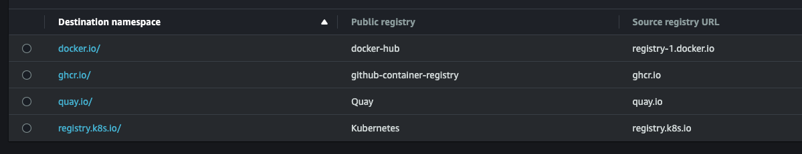

# ECR Pull-Through Cache Mutation Webhook 🚀

A Kubernetes mutation webhook that automatically redirects container image pulls through Amazon ECR's pull-through cache, optimizing performance and reducing costs.

## 🎯 What It Does

This webhook intercepts pod creation requests in your Kubernetes cluster and automatically modifies container image references to use Amazon ECR's pull-through cache. This means:

- ⚡ Faster image pulls through local caching
- 💰 Reduced network egress costs
- 🔄 Seamless integration with existing deployments

## 🚦 Prerequisites

1. **ECR Pull-Through Cache Configuration**  
   You must manually configure pull-through cache for these registries:
   - `ghcr.io`
   - `docker.io`
   - `registry.k8s.io`
   - `quay.io`

   > ⚠️ **Important**: Use registry-matching names for your configurations as required by this webhook.

   Example configuration:
   

2. **IAM Configuration**  
   Check the `aws-policies` folder for:
   - Example lifecycle policies for Creation Templates
   - ECR Registry policy examples
   - Role configurations for EKS nodes

📚 For detailed ECR Pull-Through setup, see the [AWS documentation](https://docs.aws.amazon.com/AmazonECR/latest/userguide/pull-through-cache.html#pull-through-cache-iam).

## 🛠️ Installation Options

### Option 1: Helm Chart (Recommended)

1. Clone the repository:

2. Install the chart:
```bash
helm install ecr-pull-through -n kube-system chart/ecr-pull-through \
  --set awsAccount=123456789012 \
  --set awsRegion=us-west-2
```

> 📝 **Prerequisites**: 
> - cert-manager must be installed in your cluster
> - The chart uses cert-manager to generate TLS certificates for the webhook

### Option 2: Kyverno Policies

> Note: docker.io support is limited in Kyverno configuration

1. Find policies for `docker.io`, `quay.io`, `registry.k8s.io`, and `ghcr.io` in the `kyverno` folder
2. Update AWS account ID in policies
3. Apply to your cluster

### Option 3: Manual Webhook Installation

1. Clone this repository
2. Go to `manifests` folder 
3. Configure [manifests/configmap.yaml](manifests/configmap.yaml)
4. Ensure your kubectl context points to the target cluster
5. Run `./install.sh`

> 🔑 **Note**: By default, the webhook only processes namespaces labeled with `pull-through-enabled: "true"`. Modify [manifests/bundle.yaml](manifests/bundle.yaml) to change this behavior.

## 🧪 Testing

Use the sample pod manifests in the `tests` folder to verify the webhook's operation.

## 🧹 Maintenance

### ECR Repository Cleanup
This might be useful if you are testing ECR Pull-through and want to occasionally cleanup pull-through registries.   
Use [ecr-cleanup.sh](ecr-cleanup.sh) to remove pull-through generated repositories:
```bash
./ecr-cleanup.sh
```

## 📄 License

This project is open-source and available under the MIT License.